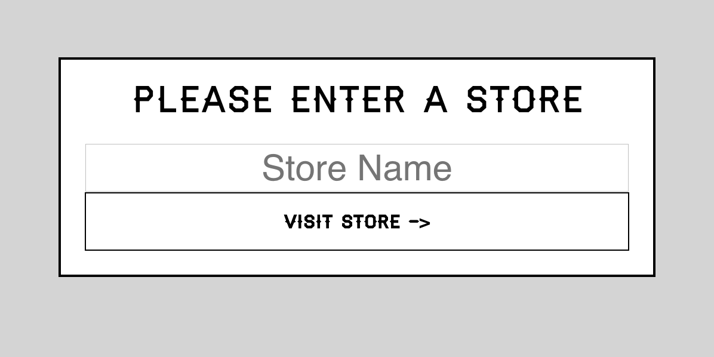
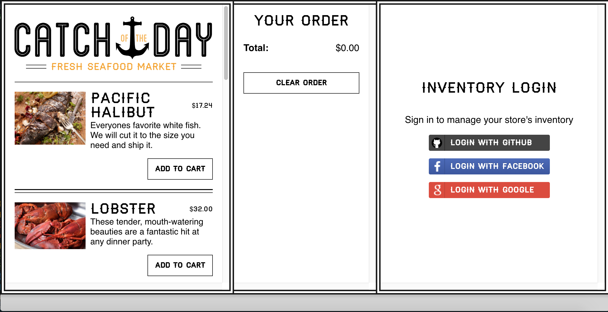
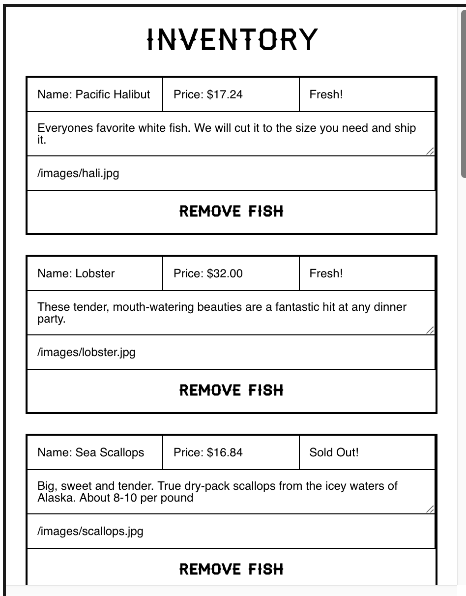
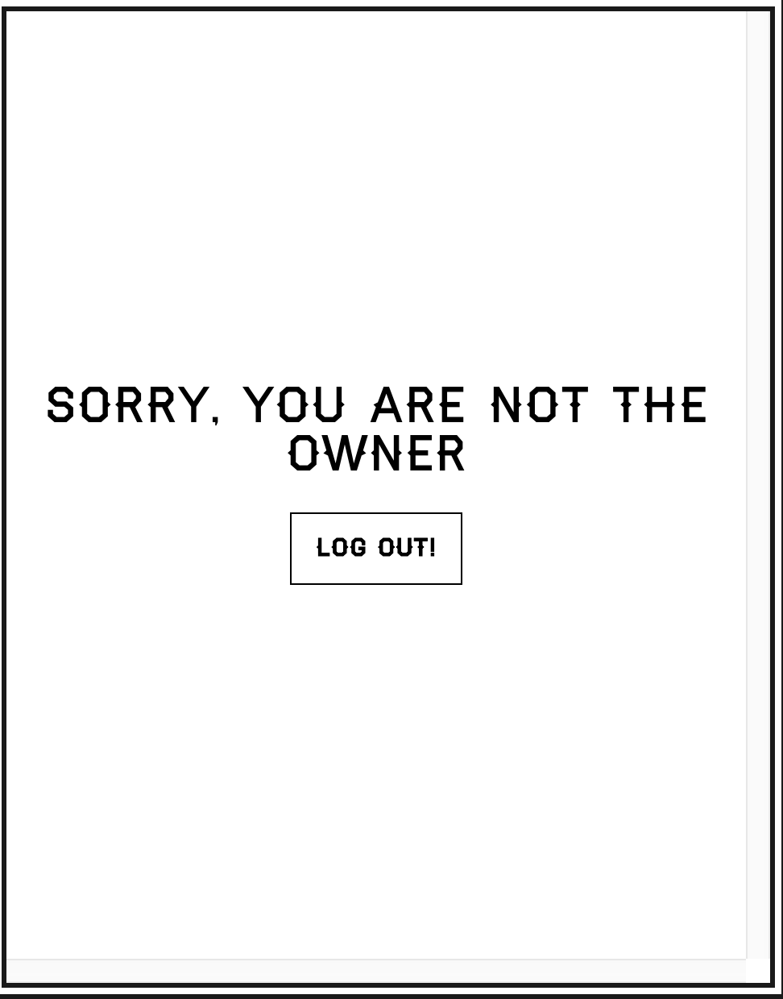
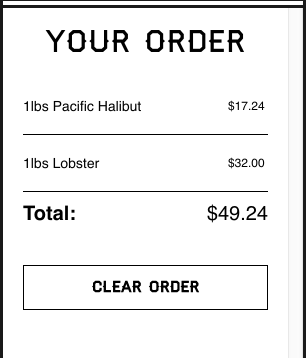

<!--  -->

# React Store Management

This project was bootstrapped with [Create React App](https://github.com/facebookincubator/create-react-app).

This project was origin based on [React for Beginners](https://reactforbeginners.com/) of WesBos

I changed the code and apply new React Context to the repos

1/ Real time integrate with Firebase database
2/ Sign in with Git, facebook, and Google account
3/ Inventory database saved in Firebase
4/ User & order saved in IndexedDB
5/ Auto test build and deploy to live-demo

## Demo

You can check the live-demo [here](https://bang-nguyen.firebaseapp.com/)

#### You need to enter a store name, if the store name existed, it will enter the store, else it will create a new store

### Main view of the app:

### You need to login to add more dishes to the menu

If you are the owner of the store, you can modify the menu as you like, or `Load Sample Fishes` to the menu

If you are not the owner of the store, you can only add dishes to your order

#### Your order will be save to the browser, so next time visit the store, just log in and you can see it again

